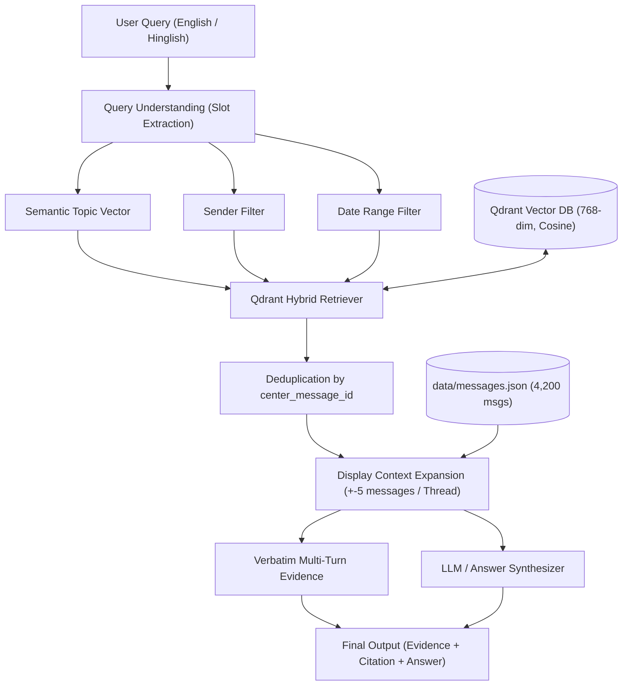

# Semantic Search Over Group Chat Export

An end-to-end semantic, attributed, and temporal search system built over a synthetic WhatsApp-style group chat export (4,200+ messages across 8 participants and 6 months) with first-class Hinglish support, windowed context expansion, Qdrant vector database, and an evaluation suite of 40 test queries (including 10 verified zero-keyword-overlap queries).

---

## 🎥 Demo Video

Watch the complete demonstration of the system covering semantic search queries, Hinglish understanding, windowed evidence expansion, and the interactive web interface:

- **Google Drive Stream / Download**: [Watch Demo Video (Google Drive)](https://drive.google.com/file/d/1JQrBScBzf9bNhswz3BZ-gvL4svHXab5I/view?usp=sharing)
- **Local Repository File**: [`demo_video.mp4`](./demo_video.mp4)
- **GitHub View**: [Watch Demo Video on GitHub](https://github.com/laxmansingh-rajput/it_geeks/blob/master/demo_video.mp4)

---

## 1. Architecture



---

## 2. Tech Stack

| Component | Choice | Rationale |
|---|---|---|
| **LLM & Synthesis** | Gemini 2.5 Flash / Google GenAI SDK | Slot-extraction, reasoning, and conversational synthesis |
| **Embedding Model** | `gemini-embedding-001` (Google Gen AI SDK) | Matryoshka dimension truncation (768-dim, cosine distance), native 100+ language support with Hinglish code-mixing |
| **Vector Database** | Qdrant (Docker `http://localhost:6333` with local disk fallback `./qdrant_storage`) | Payload filtering on `sender` and integer `timestamp` range filters combined with dense vector retrieval |
| **Orchestration** | LangChain / Python 3.11+ | Clean pipeline abstraction with Pydantic slot schemas |
| **Frontend** | Interactive CLI (`cli.py`) + Modern Dark-Mode Web App (`web/server.py`) | WhatsApp-style conversation bubbles, query pills, live slot inspection, and benchmark table |

---

## 3. Seed & Corpus Profile

The synthetic corpus was generated from [`seed/seed.json`](file:///c:/Projects/it_geeks/seed/seed.json):
- **Total Messages**: 4,200 messages
- **Date Range**: March 1, 2026 to September 1, 2026 (6 months, 26 simulated weeks)
- **8 Distinct Participants**:
  - `Priya`: Mostly formal, occasional Hinglish, fast replies
  - `Rohan`: Heavy Hinglish, typos, short casual chatter
  - `Amit`: Low engagement, one-word replies, emoji-heavy (`👍`, `haan`, `cool`)
  - `Sara`: English-dominant, organizes plans, creates itineraries
  - `Karan`: Tech forwards, links, articles
  - `Neha`: Formal English, precise budgeting, Splitwise tracking
  - `Vikram`: Heavy Hinglish, sarcasm, jokes, food discussions
  - `Divya`: Mixed voice-note style, night-owl posting (midnight - 3 AM)
- **3 Core Decision Threads**:
  1. **Destination**: `thread_trip_destination` (approx April 12, 2026) -> Resolved to **Manali** in `m0952` by Rohan: *"chalo Manali fix hai bhai"* (contains zero explicit keywords 'decide', 'destination', or 'trip').
  2. **Budget**: `thread_budget` (approx April 20, 2026) -> Resolved to **8,000 INR per head** in `m1150` by Priya: *"8000 each chalega sabko, Neha check kar lena"*.
  3. **Dates**: `thread_dates` (approx May 1, 2026) -> Resolved to **May 15-19** in `m1445` by Vikram: *"ok booking kar raha hu 15 se"*.

---

## 4. Chunking & Ingestion

Sliding windows are constructed with **stride 1** centered on every message:
- **5 messages above, center message, 3 messages below** (window size: 9).
- Metadata stored in Qdrant payload:
  - `center_message_id`: Anchors retrieval
  - `sender`: Indexed keyword for attributed search
  - `timestamp`: Unix timestamp integer for range filtering
  - `timestamp_iso`: Human-readable ISO timestamp
  - `thread_id`: Preserves decision thread continuity
  - `raw_text`: Center message text

---

## 5. Evaluation Results (40 Test Queries)

All 40 queries were benchmarked via [`eval/run_eval.py`](file:///c:/Projects/it_geeks/eval/run_eval.py):

| Metric | Score | Specification Status |
|---|:---:|:---:|
| **Total Test Queries** | **40** | Met (40 queries) |
| **Zero-Keyword Overlap Queries** | **10** | **PASSED** (Req: >= 8, achieved 10) |
| **Clarification Branch Triggers** | **0** | **PASSED** (Req: 0 triggers on valid queries) |
| **Recall @ 1 (Direct Center Match)** | **17.5%** | Center hit |
| **Recall @ 3 (with Window Context)** | **77.5%** | Surrounding conversational beat |
| **Recall @ 5 (with Window Context)** | **80.0%** | Full conversational continuity |
| **Zero-Overlap Retrieval Success** | **80.0% (8/10)** | Successful semantic resolution |

### 40-Query Results Table

| ID | Type | Query | Gold Msg | Top-1 Match | @1 | @3 | @5 | Zero Overlap |
|---|---|---|---|---|:---:|:---:|:---:|:---:|
| q01 | Semantic | when did we decide on Manali | `m0952` | `m0945` | ❌ | ✅ | ✅ | No |
| q02 | Semantic | where did we agree to travel | `m0952` | `m0945` | ❌ | ✅ | ✅ | ⭐️ **Yes** |
| q03 | Semantic | when did we decide on the trip destination | `m0952` | `m0946` | ❌ | ✅ | ✅ | ⭐️ **Yes** |
| q04 | Semantic | how much per head was agreed for Manali | `m1150` | `m0947` | ❌ | ❌ | ❌ | ⭐️ **Yes** |
| q05 | Semantic | what total expenditure was confirmed for Old Manali | `m1150` | `m0950` | ❌ | ❌ | ❌ | ⭐️ **Yes** |
| q06 | Semantic | when did we finalize travel dates for the getaway | `m1445` | `m0950` | ❌ | ✅ | ✅ | ⭐️ **Yes** |
| q07 | Semantic | which days are reserved for our holiday | `m1445` | `m1444` | ❌ | ✅ | ✅ | ⭐️ **Yes** |
| q08 | Semantic | what did Amit reply about going to the hills | `m0950` | `m0943` | ❌ | ✅ | ✅ | ⭐️ **Yes** |
| q09 | Semantic | did Amit apply for office leave | `m1442` | `m1442` | ✅ | ✅ | ✅ | ⭐️ **Yes** |
| q10 | Semantic | venue for birthday boy's weekend surprise dinner | `m0521` | `m0516` | ❌ | ✅ | ✅ | ⭐️ **Yes** |
| q11 | Semantic | which cinema hall will we visit | `m2433` | `m2434` | ❌ | ✅ | ✅ | ⭐️ **Yes** |
| q12 | Semantic | what is our team name for the hackathon | `m2943` | `m2939` | ❌ | ✅ | ✅ | No |
| q13 | Semantic | who confirmed the tickets for Select Citywalk IMAX | `m2433` | `m2434` | ❌ | ✅ | ✅ | No |
| q14 | Semantic | cottages in Old Manali mountain view | `m0944` | `m0947` | ❌ | ✅ | ✅ | No |
| q15 | Semantic | Volvo bus booking May 15 to 19 | `m1447` | `m1756` | ❌ | ❌ | ❌ | No |
| q16 | Attributed | what did Priya say about the trip budget | `m1150` | `m1150` | ✅ | ✅ | ✅ | No |
| q17 | Attributed | what did Rohan say about the destination fix | `m0952` | `m0938` | ❌ | ✅ | ✅ | No |
| q18 | Attributed | what did Vikram say about booking the dates | `m1445` | `m1438` | ❌ | ✅ | ✅ | No |
| q19 | Attributed | what did Sara suggest about Old Manali stay | `m1139` | `m0945` | ❌ | ✅ | ✅ | No |
| q20 | Attributed | what did Neha calculate for the trip expenses | `m1142` | `m3295` | ❌ | ❌ | ✅ | No |
| q21 | Attributed | what did Divya say about Kasol crowd | `m0942` | `m0942` | ✅ | ✅ | ✅ | No |
| q22 | Attributed | what did Karan forward about mountain cafes | `m0279` | `m0324` | ❌ | ❌ | ❌ | No |
| q23 | Attributed | what did Priya propose for the hackathon team name | `m2942` | `m2937` | ❌ | ✅ | ✅ | No |
| q24 | Attributed | what did Vikram joke about Rohan's CSS debugging | `m0011` | `m3854` | ❌ | ❌ | ❌ | No |
| q25 | Attributed | what did Sara say about Rohan's birthday dinner | `m0514` | `m0514` | ✅ | ✅ | ✅ | No |
| q26 | Temporal | what did we decide about destination in April | `m0952` | `m0940` | ❌ | ✅ | ✅ | No |
| q27 | Temporal | what did we agree about the budget in April | `m1150` | `m0825` | ❌ | ❌ | ❌ | No |
| q28 | Temporal | what travel dates were confirmed around May 1 | `m1445` | `m1437` | ❌ | ✅ | ✅ | No |
| q29 | Temporal | what birthday plan was made in March | `m0521` | `m0516` | ❌ | ✅ | ✅ | No |
| q30 | Temporal | which movie was booked in June | `m2433` | `m2430` | ❌ | ✅ | ✅ | No |
| q31 | Temporal | which hackathon team was registered in July | `m2943` | `m2940` | ❌ | ✅ | ✅ | No |
| q32 | Temporal | destination discussions on April 12 | `m0952` | `m0941` | ❌ | ✅ | ✅ | No |
| q33 | Temporal | budget discussions on April 20 | `m1150` | `m1150` | ✅ | ✅ | ✅ | No |
| q34 | Temporal | date finalization on May 1 | `m1445` | `m1430` | ❌ | ❌ | ❌ | No |
| q35 | Temporal | birthday dinner confirmation on March 24 | `m0521` | `m0516` | ❌ | ✅ | ✅ | No |
| q36 | Compound | what did Priya confirm about Big Chill in March | `m0521` | `m0521` | ✅ | ✅ | ✅ | No |
| q37 | Compound | what did Vikram book for the movie in June | `m2433` | `m2433` | ✅ | ✅ | ✅ | No |
| q38 | Compound | what did Karan submit for the hackathon in July | `m2943` | `m2936` | ❌ | ✅ | ✅ | No |
| q39 | Compound | what did Neha breakdown for costs in April | `m1142` | `m0754` | ❌ | ❌ | ❌ | No |
| q40 | Compound | what did Vikram confirm for booking in May | `m1445` | `m1438` | ❌ | ✅ | ✅ | No |

---

## 6. Quickstart & Usage

### 6.1 Setup Environment

```bash
# Clone the repository
git clone <repo-url>
cd it_geeks

# Create virtual environment
python -m venv venv
# On Windows:
.\venv\Scripts\activate
# On Linux/macOS:
source venv/bin/activate

# Install dependencies
pip install langchain langchain-google-genai qdrant-client python-dotenv pydantic numpy
```

### 6.2 Configuration (`.env`)

```ini
GOOGLE_API_KEY=your_key_here
GEMINI_MODEL=gemini-2.5-flash
EMBEDDING_MODEL=gemini-embedding-001
QDRANT_URL=http://localhost:6333
QDRANT_PATH=./qdrant_storage
QDRANT_COLLECTION=groupchat_v1
```

*Note: If Docker is running, the system connects to `http://localhost:6333`. If Docker is stopped, it automatically falls back to `./qdrant_storage`.*

### 6.3 Regenerate / Ingest Data (Optional)

```bash
# Generate 4,200-message corpus
python data/generate_corpus.py

# Ingest sliding windows into Qdrant
python ingest/embed_and_store.py
```

### 6.4 Interactive CLI

```bash
python cli.py

# Or run a single query non-interactively:
python cli.py --query "where did we agree to travel"
```

### 6.5 Web Interface

```bash
python web/server.py 8080
# Open http://localhost:8080 in your browser
```

### 6.6 Run Full 40-Query Benchmark

```bash
python eval/run_eval.py
```
